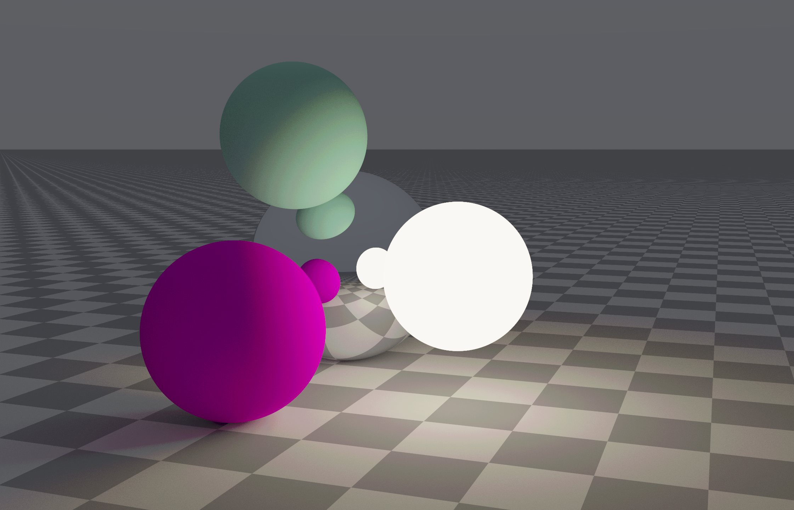

This is a C++ Vulkan Path Tracer.
More info here: https://immadh.com/projects/vkrenderer/

Current features
- Vulkan 1.3 
- GLFW window creation 
- Compute shader path tracing pipeline
- Fullscreen display pass with tone mapping
- Freecam camera
- Frame accumulation
- Diffuse, metal, emissive, and glass materials
- VMA managed Vulkan buffer and image allocation
- Resize handling and swapchain recreation
- Vulkan validation layers

